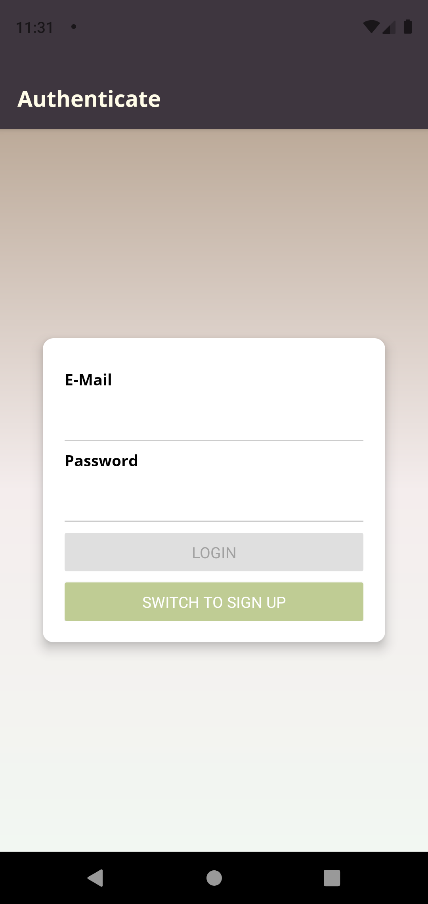

# TERRA

Welcome to TERRA frontend  This is the frontend for the TERRA project (Final project in B.Sc degree in MTA) in react native.js.

### About
---
This project is using the expo framework for react native, created for mobile users.

TERRA project was created in order to make hiring / providing sport assets as easy as it can be,
Our goal was to create an app that users can find sport facilities ( Tennis Courts / Soccer fields and etc), and hire them in specific dates for their use.

### Images
---

     
     
     
     

     
     
     
     

      
     
     
     

      
     

